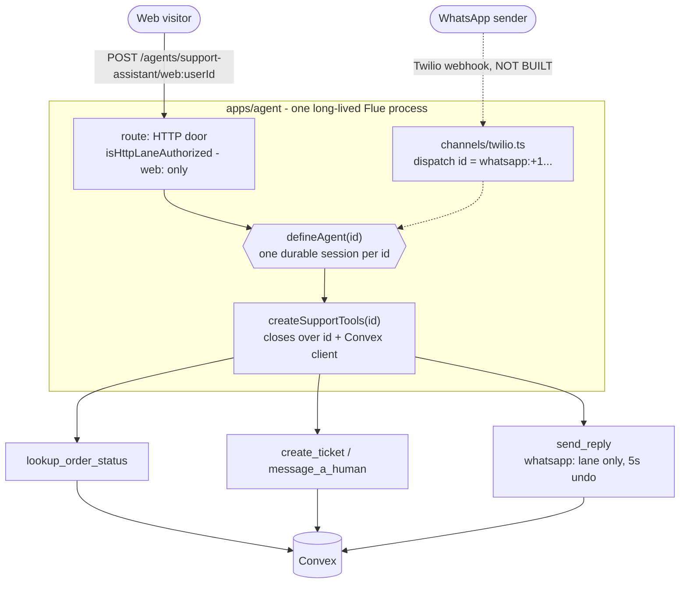
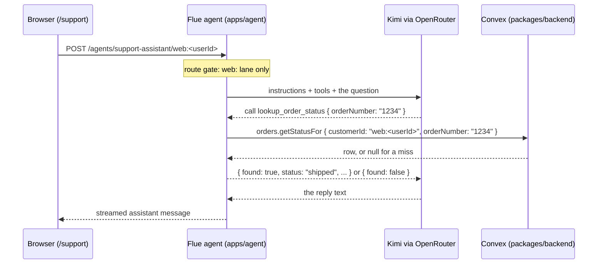
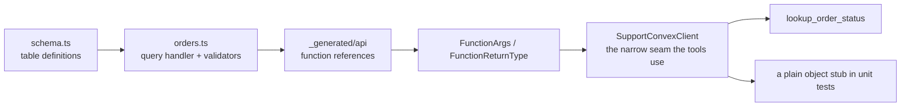
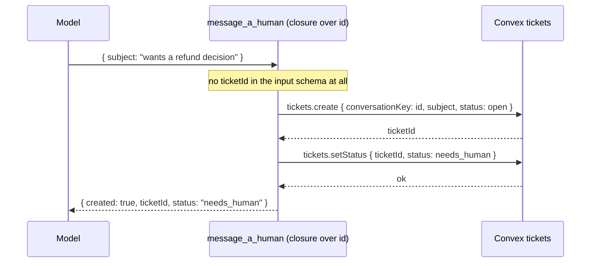
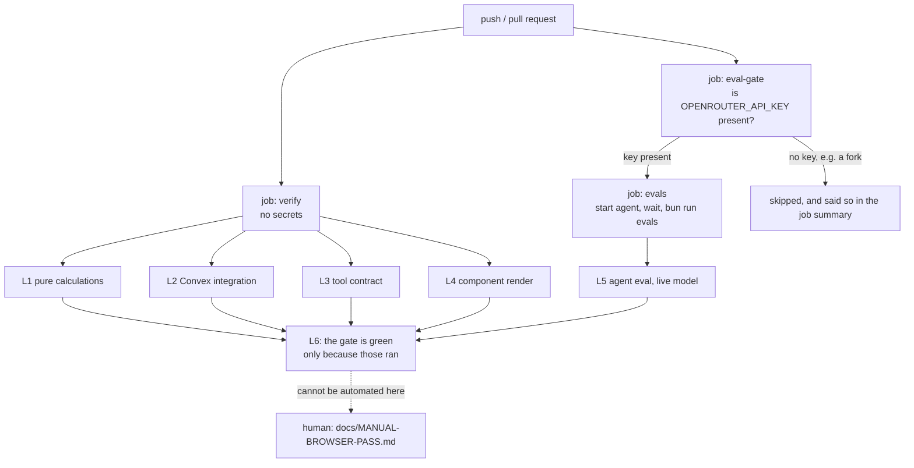

# FOR_ETHAN.md

The living production diary for the Flue support agent.

Read this as the DVD extras, not the manual. `README.md` tells you how to run the thing.
`docs/flue-support-agent-plan.md` is the pitch. `docs/IMPLEMENTATION_PLAN.md` is the shooting
script. This file is the part where the crew sits down and explains what they were thinking, what
blew up, and what they would tell you to do differently.

One rule for this document: **every claim traces to a file or a commit in this repository.** Where
something is planned but not built, it says so in the same breath.

---

## 1. The Story So Far

### Season 0: what the picture is actually for

This is not a product. It is a **spec project with a video attached**:
`docs/flue-support-agent-plan.md` opens by naming the deliverable as a working, deployed demo agent
**plus a produced screencast tutorial** teaching how to build a custom agent on Flue, the Astro
team's agent framework. The chapters of that tutorial are meant to be the commits.

That reframes every technical decision in this repo. A tutorial's job is to be *legible*, and its
closing thesis is stated in the plan as the three layers: framework, harness, product - autonomy is
cheap when the worst case is a bad reply and expensive when it is a message to a real customer.
The guarded `send_reply` tool is that thesis made concrete, which is why a five-second undo window
exists in a demo that has never sent a real message.

Domain: e-commerce customer support. Two doors: web chat and WhatsApp. One agent behind both.

### Season 1: the sets got built, nobody ever rolled camera

An overnight autonomous run produced the whole skeleton: a Convex schema with `orders`, `tickets`
and `outbox`; the Convex functions over them; a `lookup_order_status` tool and a guarded
`send_reply`; a Flue agent that wires them to a model; and a `/support` chat page in a Next app. It
all compiled. It all passed lint.

None of it had ever run. The tables were empty, the agent had never spoken to a model, and the only
tests were over pure functions that could not touch a database. `docs/HANDOFF-2026-07-24.md` names
the gap in one sentence: "green proved only that it compiles, not that it works." In the same
session, a lint-passing `<label>` change shipped a component that crashed on its first render. See
Bloopers, Take 1.

### Season 2: prove and gate what exists

`docs/IMPLEMENTATION_PLAN.md` is deliberately not a feature plan. Seven commits, almost no new
product code, all of it aimed at making the existing code demonstrably work and keeping it that
way:

| Commit | What landed | Where to look |
|---|---|---|
| 1 | Real Convex handlers run in-memory for the first time | `fe4dda8` |
| 2 | Index-scoped lookups, then seed data as one source of truth | `d89dccd`, `c602c61` |
| 3 | Render tests for the chat primitives | `a1dbdbe` |
| 4 | Model swap to Kimi via OpenRouter | `aeb0448` |
| 5 | jsdom for `apps/web`, a chat render test, the manual browser runbook | `4b82291`, `7e50a75`, `f9f9725` |
| 6 | The Flue eval harness, two eval cases, a real paid run | `a387141`, `35f7515`, `e80601a` |
| 7 | The CI gate, and the first cut of this document | `91e24c1`, `4d09df3` |

### Season 3: the stretch reel

With the gate in place, held-back work could land safely, because the layers that would catch a
regression were finally running:

| Work | What landed | Where to look |
|---|---|---|
| Escalation | `create_ticket` and `message_a_human` over the existing `tickets` mutations | `5ed028f` |
| Render sweep | Every one of the 17 `packages/ui` components mounted in jsdom | `e3713df` |
| This document | The full five-section build-out you are reading | `b79c70b` |
| Diagnostics | Three read-only probes answering "is the backend down, or is my code wrong?" | `abe92b7` |

Those probes are worth knowing before you need them. `bun run check:backend` asks whether the
deployment is reachable and a seeded order still round-trips; `bun run probe` calls every
read-only Convex function with realistic arguments and prints what the live deployment actually
returns; `bun run check:agent` asks whether the Flue process is up. All three are read-only by
construction - `probe-functions.ts` is typed to accept only query references, so handing it a
mutation is a compile error - and all three exit non-zero on failure, so they are safe to put in
a gate. When a session is stuck, they separate "the backend is down" from "my code is wrong" in
one command, which is otherwise twenty minutes of guessing.

The sweep is the clearest proof the model works: `packages/ui` went from 6 render tests to 91, and
the sweep found `DropdownMenuLabel` requiring a parent context it was never given in a test - the
`<label>` bug's exact twin, caught before it could ship this time. See Bloopers, Take 5.

### What is deliberately still missing

Not oversights. Each one is written down as out of scope in the plan it belongs to:

- **The WhatsApp lane.** `apps/agent/src/channels/twilio.ts` does not exist. The lane *prefix* is
  already load-bearing in the code, on both sides (see Cast & Crew), but no Twilio webhook has ever
  arrived.
- **A real outbound send.** `outbox.deliver` is an `internalAction` that returns `null`. The undo
  window, the scheduling and the cancel path are all real and integration-tested; the Twilio call
  at the end of them is a stub.
- **The `customers` table.** Deferred with the WhatsApp lane. For this slice the conversation `id`
  *is* the customer scope. Note that `README.md` still lists `customers` in its data-model table;
  `packages/backend/convex/schema.ts` has three tables, not four.
- **A skill.** `src/skills/refund-policy/SKILL.md` is in the pitch and is unbuilt.
- **The shadcn preset rebuild** of the chat surface, and **any deploy at all**.

---

## 2. Cast & Crew (Architecture)

### The call sheet

Six workspaces. Turborepo runs the tasks; bun holds the lockfile.

| Package | Name | Its job |
|---|---|---|
| `apps/agent` | `@support-agent/agent` | The Flue agent process: `defineAgent`, the tools, the HTTP `route`, the evals |
| `apps/web` | `web` | Next 16 app. `/support` is the chat surface. Dev server on port 3001 |
| `packages/backend` | `@support-agent/backend` | Convex: schema, functions, seed, and the integration tests beside them |
| `packages/ui` | `@support-agent/ui` | 17 shadcn / Base UI primitives, and the 91 render tests over them |
| `packages/env` | `@support-agent/env` | One typed env schema (t3-env + Zod), exported as `./web` |
| `packages/config` | `@support-agent/config` | Shared TypeScript config. No scripts, no code |

### The three rooms

Think of a post house. Footage lives in the vault, an editor works on it, and the audience only
ever sees the screen.

- **The vault: `packages/backend`.** Convex holds the orders, tickets and outbox rows, and the
  query and mutation functions that are the only sanctioned way in. Nothing else reads the tables
  directly.
- **The editor: `apps/agent`.** A Flue agent process. It holds the model, the instructions, and the
  tools. It is the only thing that talks to both the vault and the audience.
- **The screen: `apps/web`.** A Next app. `/support` renders `Chat.tsx`, which uses
  `useFlueAgent` from `@flue/react` and speaks HTTP to the agent process. It never touches Convex
  for order data.

Two smaller departments serve all three. `packages/ui` is the prop shop: primitives with no
knowledge of orders or agents, which is why they can be render-tested in isolation.
`packages/env` is continuity: one schema that says which environment variables exist, so a missing
`NEXT_PUBLIC_CONVEX_URL` fails at `next build` rather than at a customer's first click.

### Two doors, one agent

The identity model is the load-bearing design decision in the whole project, and it is one string:
the conversation `id`, carrying a lane prefix.



The dotted path is the door that does not exist yet. What already exists is the **gate on both
sides of it**, and each gate is a pure function with its own unit test:

- `isHttpLaneAuthorized` in `apps/agent/src/agents/support-assistant.ts` refuses any id that does
  not start with `web:`, returning a 404 rather than a 403 so the route never confirms which
  instances exist.
- `send_reply` in `apps/agent/src/shared/support-tools.ts` throws unless the id starts with
  `whatsapp:`. A browser session structurally cannot text a phone.

**The rejected alternative, because it is the more interesting half.** The obvious design is one
unified session keyed by resolved customer identity, so a person who chats on the web and then
messages on WhatsApp continues one conversation. `docs/flue-support-agent-plan.md` rejects it for
two reasons: an unverified inbound phone number cannot be safely bound to a web account without a
separate verification step, so a shared key leaks one channel's session into the other; and a
merged session would carry the WhatsApp-bound `send_reply` into a web chat, dissolving the exact
gate above. Cross-channel context is meant to be correlated in Convex, never merged into one
session.

### One question, end to end

A customer types "where is order #1234". Follow the signal like a patch on a soundboard: browser to
agent process, agent to model, model back through a tool, tool to Convex, and the answer back up
the same chain.



The load-bearing detail is the box the browser never fills in. `customerId` is not model input and
not request input. It is the conversation `id`, closed over when the tools are built
(`createSupportTools(id)` in `apps/agent/src/shared/support-tools.ts`). The model can choose the
order number. It cannot choose whose orders it is looking at.

That single string does three jobs at once, which is worth knowing before you debug anything here:

1. the HTTP route gate serves it only if it starts with `web:`
   (`isHttpLaneAuthorized`, `apps/agent/src/agents/support-assistant.ts`),
2. it is passed to Convex as `customerId`, so it is the data scope,
3. Flue keys the stored conversation by it, so it is also the session key.

Job 3 is the one nobody writes down, and it is what makes the eval suite subtle. See Bloopers,
Take 4.

### The tool bench

Four tools, built per conversation by one factory. Each is a `defineTool` with a Valibot input
schema, a Valibot output schema, and a `run` that holds the authorization.

| Tool | The model may choose | The model may not choose | Guard |
|---|---|---|---|
| `lookup_order_status` | `orderNumber` | whose orders (the closure `id`) | none needed |
| `create_ticket` | `subject` | the conversation key, the ticket id | none |
| `message_a_human` | `subject` | the conversation key, the ticket id | none |
| `send_reply` | `body` | the recipient (the closure `id`) | `whatsapp:` lane only, plus a 5s undo |

`createSupportTools` returns them as a **tuple**, not an array, so each position keeps its own tool
type instead of collapsing into a union of `run` signatures. The escalation pair lives in its own
module (`escalation-tools.ts`) with its own narrow Convex slice. That split is readability and
nothing more: no `max-lines` rule is configured in `.oxlintrc.json`, so inlining the pair would
have compiled and linted fine. Escalation is simply its own capability over its own slice of the
backend, and reads better with a seam.

### From transcript to bubbles

The screen's job is small and deliberately dumb. `@flue/react`'s `useFlueAgent` hands back the
durable transcript; `toSupportBubbles` in `apps/web/src/app/support/message-view.ts` flattens it to
`{ id, align, text }` and nothing else. Reasoning parts, file parts and tool parts fold away there
rather than leaking placeholder text into a bubble, and the view layer never branches on `role` or
reaches into `parts`. That is why the message transform is a pure-function unit test (L1) and the
composition around it is a render test (L4) - two different instruments for two different failures.

### The safety net crew (the six layers)

Every layer catches a class of failure the others structurally cannot see. This is the table from
`docs/IMPLEMENTATION_PLAN.md`, updated to where each layer actually lives now that all six exist.

| Layer | Catches | Owner | Lives in |
|---|---|---|---|
| L1 pure calculations | status mapping, message view transforms, the lane gate | ours | `apps/agent/tests`, `apps/web/tests/message-view.test.ts` |
| L2 Convex integration | the database-to-app seam: scoping, outbox lifecycle, ticket transitions | ours | `packages/backend/convex/*.integration.test.ts` |
| L3 tool to Convex contract | closure scoping, the lane gate, drift from the real handlers | ours | `apps/agent/tests/support-tools.test.ts`, `escalation-tools.test.ts` |
| L4 component render | render-time crashes, accessible roles, the composition | ours | `packages/ui/tests`, `apps/web/tests/chat.test.tsx` |
| L5 agent eval | tool trajectory and anti-fabrication, against a live model | Flue | `apps/agent/src/evals` |
| L6 the gate | all of the above, on every push | ours, shaped by Flue's blueprint | `.github/workflows/ci.yml` |

A seventh row exists and is a human: the manual browser pass in
`docs/MANUAL-BROWSER-PASS.md`. It cannot be automated here (no browser, no auth secret in CI), and
L5 is its automatable proxy.

---

## 3. Behind the Scenes (Decisions)

### Why Flue, and why not the Vercel AI SDK

Start with the honest part: **there was no bake-off.** The deliverable is a tutorial about Flue, so
Flue is the subject of the piece, not the winner of a comparison. No Vercel AI SDK implementation
of this agent exists to measure against. `docs/IMPLEMENTATION_PLAN.md` records the decision as one
line - "Web agent runtime: Flue stays. No Vercel AI SDK" - and the reason it needed recording at
all is that the Next app is right there and the temptation to collapse the agent into a route
handler is real.

What can be said with evidence is what Flue actually earns in this repository, and what it charges
for it.

**What Flue owns, so we never wrote it.** The agent loop itself. One durable session per instance
id. The HTTP surface at `/agents/<name>/<id>`, including a Hono middleware hook (`export const
route`) that is where our lane gate lives. The tool protocol: `defineTool` validates the model's
arguments against the input schema before `run` sees them, and validates the return value against
the output schema after. `@flue/react`'s `useFlueAgent` and `FlueProvider`, and the `@flue/sdk`
client both the browser and the eval harness use. The eval harness blueprint and the GitHub Actions
blueprint. The scale of that is visible in the line counts: our entire agent definition is about 70
lines, and the tools are roughly 340 across two files. There is no loop code in this repo at all.

**What it charges.**

- **One long-lived process, not serverless.** Flue wants one owner process per agent instance, so
  the agent cannot live in a Vercel function. That is a hosting decision made at the framework
  boundary: the Flue app and the Next app go on one host, per `docs/HANDOFF-2026-07-24.md`.
- **Valibot at the boundary, not Zod.** `defineTool` is typed against Valibot schemas, so the agent
  package speaks Valibot while `packages/env` speaks Zod. See the next section.
- **Tools get no dependency injection.** Flue's `ToolContext` is `{ signal, input }`. There is no
  `deps`, no `env`, no data handle. Tools reach Convex by closure because there is no other way -
  which turns out to be a gift, since the closure is exactly where authorization wants to live.
- **No faux model provider ships.** There is no scripted or recorded provider to test the loop
  against, so verifying agent behaviour means paying a real model. That single fact is why L5 is an
  eval suite rather than a unit test, and why model price became a design constraint.
- **It is a beta.** Everything here is pinned at `1.0.0-beta.9`, and the framework's own
  `vitest-evals` blueprint no longer compiles against the packages it installs today (its example
  imports type names that were removed in `vitest-evals` 0.14.0 and renamed in `@flue/sdk`). The
  harness in `apps/agent/src/evals/harness.ts` is the blueprint's design, adapted to the shipped
  API, with the blueprint marker kept as its first line.

### Why Convex

Also honest: Convex was the stack the project already stood on. The pitch document describes
`packages/backend/convex/schema.ts` as `defineSchema({})`, empty, waiting for tables - the backend
existed before the agent did.

What it earns, in this repo specifically:

- **The undo window is durable because Convex schedules it, not the agent.** `outbox.enqueue`
  inserts a `pending` row, then calls
  `ctx.scheduler.runAfter(UNDO_WINDOW_MS, internal.outbox.deliver)`.
  An in-process `setTimeout` inside the agent would evaporate on restart, and we have *measured*
  that the Flue dev session store is per-process: restart `flue dev` and the conversation is gone.
  Anything that must survive a restart cannot live in the agent process.
- **The generated API makes the tool layer type-safe for free.** `FunctionArgs` and
  `FunctionReturnType` read the real function references, so the agent cannot drift from the
  backend. See the Director's Commentary.
- **Seeding is unreachable from outside.** `seed.run` is an `internalMutation`, so nothing public
  can seed anything.
- **Identity comes from the same system.** `@convex-dev/better-auth` provides the session whose
  `user.id` becomes `web:<userId>` in `Chat.tsx`, so the web lane's session key and the app's auth
  are not two independent notions of "who".
- **The handlers can be tested without the cloud.** See two sections down.

The costs are real and worth knowing before your first schema edit. Convex is a document store with
no foreign keys, so relations are a convention (`v.id("table")`), and scoping has to be designed:
`orders.getStatusFor` is scoped by a composite index `by_customerId_and_orderNumber` rather than by
filtering after a lookup, because `.unique()` on order number alone throws the moment two customers
share a number. And `convex/_generated/` is committed, because regenerating it requires a deploy
key - which means a schema change is not a local-only edit.

### Three validators, one letter `v`

This trips everybody, so it gets its own beat. There are three schema libraries in this repo and
two of them are imported as `v`:

```typescript
// apps/agent/src/shared/support-tools.ts - Valibot. Flue requires it at the tool boundary.
import * as v from "valibot";

// packages/backend/convex/orders.ts - Convex's own validators. Nothing to do with Valibot.
import { v } from "convex/values";

// packages/env/src/web.ts - Zod, via t3-env, for environment variables only.
import { z } from "zod";
```

The decision recorded in `docs/flue-support-agent-plan.md` is to keep them separate and write **no
conversion layer** between them, on the grounds that a Zod-to-Valibot bridge would be
over-engineering. The line to remember: which `v` you are looking at is decided by which side of
the tool boundary the file sits on.

### Kimi via OpenRouter, which is what unlocked L5 at all

The previous handoff deferred evals on cost. `openrouter/moonshotai/kimi-k2.6` made them cheap
enough to stop deferring. Measured, not estimated: a two-case run costs roughly two cents and about
fifteen seconds of wall clock, at 2100 to 2400 tokens per case, with startup around 200ms. A layer
you can afford to run on every push is worth more than a better layer you keep postponing.

The model choice also follows from where correctness lives. The comment in
`apps/agent/src/agents/support-assistant.ts` says it plainly: support is high-volume and
latency-sensitive, and the load-bearing correctness lives in the validated tool boundary rather
than in model cleverness. A smarter model would not make `lookup_order_status` more correct.

One consequence to hold on to, because it shapes how the eval cases are written: Kimi is a
**reasoning model**. Its deliberation is returned alongside its reply - a trivial "reply with
exactly: harness ok" prompt spent 94 reasoning tokens before answering. Two things follow. A low
`max_tokens` would return `content: null` with no error at all (the catalog gives this model 4096,
so it is not a live risk here, but it is the first thing to check if a reply ever comes back
empty). And assertions must read the reply, never the transcript. See the Director's Commentary.

### convex-test rather than the cloud deployment

L2 runs the real handler code against an in-memory reimplementation of Convex. It is fast, it needs
no deploy key, it cannot be affected by whatever state somebody left in the dev deployment, and it
cannot corrupt that deployment either. Thirteen tests across four files currently run there,
including the two that matter most: that a different `customerId` asking for your order gets
`null`, and that cancelling an already-`sent` outbox row leaves it `sent`, so a late cancel can
never un-send.

It has a shape you have to respect. The tests need vitest's `edge-runtime` environment for edge
globals, and they must live **inside** `convex/` with `import.meta.glob('./**/*.ts')`, so the
module map keys match the paths Convex uses to resolve `api.*`. Convex excludes `*.test.ts` from
deployment, so colocating them is safe.

The trade is that it is a reimplementation, not the real backend, and - the sharper edge - it knows
nothing about whether the cloud deployment holds any rows. That blind spot is exactly what Bloopers
Take 2 is about, and it is why L5 exists: the eval suite reads the actual cloud deployment through
the actual tool.

### The seed is the single source of truth

You cannot demo a support bot against an empty database, and you cannot test one against a
different set of rows than the demo uses. So the demo data is defined exactly once, as data:

- `packages/backend/convex/seedData.ts` exports `DEMO_CUSTOMER_ID` and `DEMO_ORDERS`. No I/O, no
  logic. Just the list. Its row type is `Omit<Doc<"orders">, "_id" | "_creationTime" |
  "customerId">`, so a schema change breaks this file at compile time rather than at seed time.
- `packages/backend/convex/seed.ts` stages that list into a real deployment. It is an
  `internalMutation`, so nothing public can seed anything, and it patches on
  `(customerId, orderNumber)` rather than inserting, so running it twice cannot leave duplicate
  rows behind.
- `packages/backend/convex/seed.integration.test.ts` stages the same list into the in-memory test
  database and then queries it back through the real `orders.getStatusFor` handler.

One list, staged two ways. The demo and the tests can never disagree about what the data is, and
"order 1234 is shipped" is a fact both the eval suite and a human demo can rely on.

### Where Flue's batteries stop

Flue ships a lot, and the temptation is to assume the framework covers testing too, and to write
nothing. The boundary we settled on, and the reason it sits exactly there:

- **Flue owns the agent loop, so Flue owns L5.** The eval harness drives the agent through its
  public HTTP boundary using `@flue/sdk`, the same door the browser uses. We adapted it; we did not
  invent it.
- **Flue owns the gate's shape, so Flue's blueprint informs L6.** The workflow is ours, but the
  start-agent, wait-for-health, run-evals sequence is the blueprint's.
- **Convex is the data layer, and Flue has no opinion about it.** No amount of framework maturity
  will make Flue assert that a second customer cannot read your order. That is L2, and it stays
  hand-built forever.
- **The DOM is the presentation layer, and `@flue/react` gives you a data hook, not DOM
  assertions.** Whether `<Bubble>` mounts, and whether the customer's message lands on the correct
  side of the thread, is L4. Also hand-built forever.

That boundary is the whole "green gates lie" fix in one line: lean on the framework where the agent
loop lives, and never let it imply coverage of the two layers it structurally cannot reach.

### Evals are a separate command, not part of `turbo run test`

`bun run test` must stay fast, offline and free, because it runs constantly. `bun run evals` needs
a running agent process, a live database and a paid API key. Mixing them would mean either a slow,
expensive inner loop or an eval suite that silently never runs. So `*.eval.ts` is excluded from the
vitest `test` glob, and CI runs the two as separate jobs.

Two smaller choices inside that one. The root `evals` script hops straight to the package
(`bun run --cwd apps/agent evals`) rather than going through turbo, because turbo would happily
cache the result of a live model run and its strict env mode would filter the API key out of the
task environment. And `passWithNoTests` is deliberately **not** set: if the eval files ever stop
being discovered, the suite must fail rather than report a green with nothing in it.

---

## 4. Bloopers (Bugs & Fixes)

### Take 1: the `<label>` that crashed on its first frame

**What happened.** A component change swapped the `Label` primitive to Base UI's `Field.Label`. It
type-checked. It passed lint. It satisfied the accessibility rule it was written to satisfy. It
also crashed the moment it rendered, because `Field.Label` requires a `Field.Root` ancestor that
was not there.

**Why nothing caught it.** `packages/ui` had no render tests. The type checker cannot see a runtime
context requirement, and the linter has no idea what a React context is. Both were green, and both
were right about what they actually check.

**The fix.** Two parts, and only the second one matters long-term. The immediate fix reverted to a
Radix `Label`, which works standalone. The durable fix is commit 3:
`packages/ui/tests/chat-primitives.test.tsx` mounts each primitive in jsdom, and the comment at the
top of that file says the quiet part out loud - a passing render *is* the assertion.

**The lesson.** A whole class of failure lives in the gap between "compiles" and "mounts". The only
instrument that reads it is actually mounting the thing.

### Take 2: the eval path that queried an empty database

**What happened.** The plan reached the eval commit with L2 green, the tool tests green, and the
`orders` table in the dev deployment completely empty. Every integration test passed because
`convex-test` seeds its own in-memory rows. Had the evals run at that point, the agent would have
correctly answered "I could not find order #1234", the anti-fabrication case would have passed, and
the lookup case would have failed with no obvious cause.

**Why nothing caught it.** No test in the suite reads the cloud deployment, by design. So the
suite's greenness carried no information about it at all.

**The fix.** Seed the deployment from the same list the tests use (`npx convex run seed:run`), and
verify by direct read rather than by inference. Then write the eval case so it cannot pass by
accident: the lookup case asserts the tool was called with `orderNumber: "1234"` **and** that it
came back `{ found: true, status: "shipped" }`, so an empty database fails it at the trajectory,
not just at the wording.

**The lesson.** An in-memory test tells you the code is right. It tells you nothing about whether
the data is there. Those need separate evidence.

### Take 3: the linter that linted nothing and reported success

**What happened.** The plan's CI job was `turbo run check-types lint test build`. `turbo.json`
declares a `lint` task, but no workspace package declares a `lint` script, so the task matched zero
packages, executed nothing, and exited 0 with a cheerful "Tasks: 0 successful, 0 total".

**Why it is the same bug as the other two.** A gate that cannot fail is indistinguishable, from the
outside, from a gate that passes.

**The fix.** `.github/workflows/ci.yml` runs the four root scripts as four named steps, which are
the same commands a developer runs locally. The real linter is the root script `oxlint && eslint
packages/backend/convex`.

**The lesson.** Before trusting any gate, make it fail on purpose once.

### Take 4: an eval suite that only passed the first time

**What happened.** The eval instance id has to be exactly `web:demo_customer`, because that string
is also the customer scope for the seeded rows. That means both eval cases share one conversation.
Run the suite twice against the same long-lived agent process and the second run fails: the agent
answers "I still couldn't find order #9999" from memory, without calling the tool at all. Zero tool
calls, and a correct assertion failing on an agent that was behaving sensibly.

**The fix, and the fix that was refused.** Loosening the "the agent looked it up" assertion would
have deleted the case's entire meaning, so that was off the table. Instead the harness now tracks
the message ids it produced and refuses to prompt an instance that already holds foreign ones,
failing in about 200ms with an explanation and no paid model call (`e80601a`). CI gets the correct
behaviour for free, because it starts a fresh agent process inside the job.

**The lesson.** When a test fails for an environmental reason, fix the environment or fail loudly
about it. Weakening the assertion converts a real signal into a permanently silent one.

### Take 5: the `<label>` bug's twin, caught this time

**What happened.** While render-testing the remaining `packages/ui` components, a first attempt
placed `DropdownMenuLabel` as a sibling of `DropdownMenuGroup` rather than inside it:

```
Error: Base UI: MenuGroupContext is missing. Menu group parts must be used within
<Menu.Group> or <Menu.RadioGroup>.
 ❯ useMenuGroupRootContext .../@base-ui/react/menu/group/MenuGroupContext.mjs:10:11
```

Structurally identical to Take 1: a component that requires a parent context, invisible to the type
checker, fatal at mount.

**Why this one is a good news story.** The app is already correct -
`apps/web/src/components/user-menu.tsx` nests the label inside `DropdownMenuGroup`, and
`mode-toggle.tsx` uses no label at all. So the test pins a requirement rather than reporting a
defect, and it says so in its own comment so nobody reads it as a fix. The interesting contrast
came from the same sweep: `TooltipProvider` turned out to be genuinely optional, because Base UI's
provider only shares a delay between tooltips. Both facts are now tests, because "which of these
needs a parent" is precisely the question Take 1 answered wrong.

**The lesson.** The second time a class of bug appears, it should show up as a red test in a sweep
rather than as a crash in a browser. That is what a layer is *for*.

### Take 6: the coverage checker that counted files

**What happened.** The render sweep's completeness was checked by matching each file in
`src/components/` against the test files importing it. All 17 came back covered. A second pass over
each file's **export** block found 11 untested exports, 7 of them mountable components - including
`BubbleGroup`, which the real `Chat.tsx` uses on every message.

An earlier version of the same checker was worse: it matched identifiers appearing anywhere in the
test file, so `buttonVariants` counted as covered because it had been *mentioned in a comment*.

**The fix.** Check imported bindings, not text, and count exports, not files. All 7 components are
now mounted. The five exports still uncovered are named and reasoned about rather than hidden:
`buttonVariants` and `markerVariants` are cva builders rather than components, and three
`useMessageScroller*` hooks are re-exported verbatim from `@shadcn/react` and used nowhere in this
repo.

**The lesson.** Coverage numbers are only as honest as the unit they count. "17 of 17 files" and
"7 components never mounted" were both true at the same time.

### Take 7: the API reference that is never equal to itself

**What happened.** A stub for the ticket mutations dispatched on `reference === api.tickets.create`
and silently took the else branch, returning `null` as the ticket id. Convex's generated `api`
object is a proxy that mints a fresh reference object on every property access, so
`api.tickets.create === api.tickets.create` is `false`.

Worse, the failure was illegible. Any failing assertion that prints a recorded call holding one of
those proxies reports:

```
PrettyFormatPluginError: Cannot convert object to primitive value
```

instead of a diff. That hazard was already latent in every `expect(fn).toHaveBeenCalledWith(api.x,
...)` in the repo; it had simply never fired, because those assertions passed.

**The fix.** Dispatch and assert on `getFunctionName(reference)` instead. The tool tests now
compare an array of `[functionName, args]` pairs, which pins call order as well and prints a real
diff when it fails - a benefit that showed up immediately in the next self-check.

**The lesson.** An assertion you have never seen fail may not even be able to *report* a failure.

---

## 5. Director's Commentary

> **Format for entries in this section.** Lead with the insight in plain language, then a short
> commented snippet of real code from this repository, then - only where the flow genuinely needs
> a picture - a mermaid diagram immediately after the snippet. Sequence diagrams for round trips,
> flowcharts for structure. Never lead with the diagram alone: the snippet is what proves the
> insight is about this codebase and not about software in general.

### Derive your types, never restate them

The tools call Convex functions. The naive way to type that is to write out the argument and return
shapes by hand in the tool file. That works for exactly as long as nobody edits the schema, and
then it silently lies, because a hand-written type has no relationship to the function it claims to
describe.

Convex generates an API object from your function files. Its types can be interrogated, so the tool
layer asks the generated API what a function takes and returns instead of asserting it:

```typescript
// apps/agent/src/shared/support-tools.ts
import { api } from "@support-agent/backend/convex/_generated/api";
import type { FunctionArgs, FunctionReturnType } from "convex/server";

// Ask the function reference what it takes and what it gives back. Nothing here
// restates a shape, so nothing here can drift from the handler.
type OrderStatusQueryArgs = FunctionArgs<typeof api.orders.getStatusFor>;
type OrderStatusRow = NonNullable<FunctionReturnType<typeof api.orders.getStatusFor>>;
```

Change `orders.getStatusFor` to require a third argument and the agent package stops compiling. The
schema is the negative; every type downstream is a print from it.



The same discipline runs the other way through `seedData.ts`, whose row type is derived from
`Doc<"orders">`, and through `SupportConvexClient`, which is deliberately narrowed to the one query
and the three mutations the tools use - one overload per function, assembled by intersecting the
escalation module's own slice. Narrow enough to satisfy with an object literal in a test, wide
enough that the real `ConvexHttpClient` still assigns to it.

The same trick names a status without restating it. `create_ticket` needs the literal `"open"` for
its output schema, and `"open"` is the backend's word, not the agent's, so the agent asks:

```typescript
// apps/agent/src/shared/escalation-tools.ts
type TicketStatus = FunctionArgs<typeof api.tickets.setStatus>["status"];

// `satisfies` keeps the literal type - the output schema stays precise - while
// still checking the string against the backend's own union.
const TICKET_OPEN = "open" as const satisfies TicketStatus;
```

### Authorization belongs in the closure, not in the schema

A tool's input schema is a description of what the model may say. It is not a security boundary,
because the model writes the input. Anything the model must not choose has to come from somewhere
the model cannot reach.

```typescript
// apps/agent/src/shared/support-tools.ts
// What the model passes in: just the order number. Deliberately no customer
// field - the caller's identity comes from the closure, never the model.
const lookupOrderStatusInput = v.object({ orderNumber: v.string() });

// ...and inside `createSupportTools(id)`, where `id` is the conversation key:
run: async ({ input }) => {
  const row = await client.query(api.orders.getStatusFor, {
    customerId: id,                      // from createSupportTools(id), not from input
    orderNumber: input.orderNumber,      // the only thing the model gets to decide
  });
  return toLookupOrderStatusOutput(row);
},
```

`send_reply` takes the same idea one step further: it throws unless the conversation `id` is on the
`whatsapp:` lane, so a browser session structurally cannot text a phone. The refusal lives in
`run`, before any I/O, and it is unit-tested as a pure decision.

The escalation pair shows the third move in the same family: **leaving something out**.
`create_ticket` and `message_a_human` take a `subject` and nothing else - no customer id, no
conversation key, and crucially no ticket id. `message_a_human` escalates the ticket its own
`create` call just returned, so there is no turn of the conversation in which the model holds a
ticket id it could aim somewhere else.



Order matters and is asserted: create first, then transition. If the transition fails the case
still exists as an `open` ticket, and the failure is not swallowed, because the model has to learn
the escalation did not land. `tickets.setStatus` checks no ownership and does not have to, because
no session can name a ticket that is not its own. Compare that with an input schema that accepted
`ticketId` and then had to be defended: the defence is the thing that eventually gets forgotten.

### Assert on what the user reads, not on what the model thought

Kimi is a reasoning model. Its deliberation is returned alongside its reply, and that deliberation
legitimately contains words like "shipped" while the reply correctly declines to state a status.
Assert against the transcript and you will eventually fail an agent that behaved perfectly.

```typescript
// apps/agent/src/evals/support-assistant.eval.ts
// Assert on the reply only. `kimi-k2.6` reasons out loud, and its deliberation
// legitimately contains status words while the reply correctly declines.
expect(result.output).toContain(UNKNOWN_ORDER);
expect(statusWordsIn(result.output)).toEqual([]);
```

Two related choices in that file are worth copying. `statusWordsIn` scans the **whole**
`ORDER_STATUSES` vocabulary rather than just the seeded `shipped`, which is what makes "it did not
invent a status" a real claim instead of one lucky word. And both cases assert over the whole list
of tool calls rather than assuming exactly one, because an agent that retries with a reformatted
order number is behaving correctly and an eval that fails it is a bad eval.

### A test you have never seen fail is a rumour

This is the working practice behind every green tick in this repo. A new assertion is not finished
when it passes; it is finished when you have broken the thing it guards and watched exactly that
assertion go red, for exactly the right reason.

```typescript
// apps/web/tests/chat.test.tsx
// The lane prefix is load-bearing, not cosmetic: the agent's `route` authorizes
// on it, and it is what keeps the WhatsApp-only `send_reply` tool from firing on
// a browser session. A dropped prefix would still render a working-looking chat.
expect(options?.id).toBe("web:u1");
```

Changing `Chat.tsx` to mint `whatsapp:${userId}` for one run produced exactly one failure:

```
AssertionError: expected 'whatsapp:u1' to be 'web:u1'
 Tests  1 failed | 3 passed (4)
```

One failure, not three, is the part worth noticing. It says the assertion is specific: it fails
when the lane prefix is wrong and stays quiet about everything else. The same discipline caught a
subtler one in the UI sweep - deleting `data-slot="input-group-control"` from `InputGroupInput`
made the assertion report the slot it had silently inherited from `Input`, which is exactly how
the composer would have stopped showing focus while every gate stayed green.

Cheap rule of thumb: if you cannot describe the edit that would make an assertion fail, the
assertion is decoration.

### Shim the environment, never the component

There is a real difference between making a component look like it works and making the test
environment look like a browser. The first hides bugs; the second removes a fake obstacle.

`<Toaster>` from sonner ships in the real app, and it crashed in jsdom with
`TypeError: window.matchMedia is not a function`. jsdom documents `matchMedia` as unimplemented;
every real browser has had it for a decade. So the component is right and the environment is
missing something:

```typescript
// packages/ui/tests/setup.ts
// This is an environment shim, not a test double: it makes jsdom look more like
// a browser rather than making a component look like it works.
window.matchMedia = stubMediaQueryList;
```

The test that a shim is legitimate: neuter it and the failure must be an *environment* error
(`window.matchMedia is not a function`), never a wrong assertion about the component. And it is
wired through `setupFiles` for the whole package rather than one test, because scoping it to sonner
would have mislabelled an environment gap as a sonner problem.

The honest limits of the same environment are worth writing down next to it. jsdom reports every
element as zero-height and implements no scrolling, so the message scroller's autoscroll, its
button's active state, and every hover or focus style are unobservable in L4. Those belong to the
human pass in `docs/MANUAL-BROWSER-PASS.md`. A layer that names what it cannot see is worth more
than one that quietly implies it saw everything.

### Green means all six layers ran

This is the rule the whole durability slice exists to make true. "The build is green" is only
meaningful if you can say which layers produced that green. In this repository you can point at the
file:

```yaml
# .github/workflows/ci.yml, job `verify`, step names elided.
# L1 through L4, no secrets, so forks and secretless pull requests run all of it.
- run: bun run check-types   # the type floor the four layers stand on
- run: bun run lint          # the ROOT script, not `turbo run lint` - see Take 3
- run: bun run test          # L1, L2, L3 and L4: every vitest suite in the monorepo
- run: bun run build         # the Next build, which also validates the env schema
```



Three things that diagram is being honest about, and each one is a decision rather than an
accident:

1. **The evals job reports *skipped*, not *passed*, on a fork.** The `secrets` context is not
   readable from a job-level `if`, so a small gate job turns the secret into an output first. The
   alternative, guarding every step with the same condition, would have shown a green "success"
   with all steps skipped. That is a green that means nothing, which is the failure this whole
   document is about.
2. **A run with a model key but no `CONVEX_URL` fails loudly.** A fork has neither and never
   arrives; a repository with one and not the other is misconfigured, and it gets an explicit
   error instead of a paid model call against a database it cannot read.
3. **L6 cannot cover the browser pass.** No browser exists in CI, and no test claims otherwise.
   That step is a documented human runbook, and L5 is its proxy. An honest gate names what it does
   not cover.
