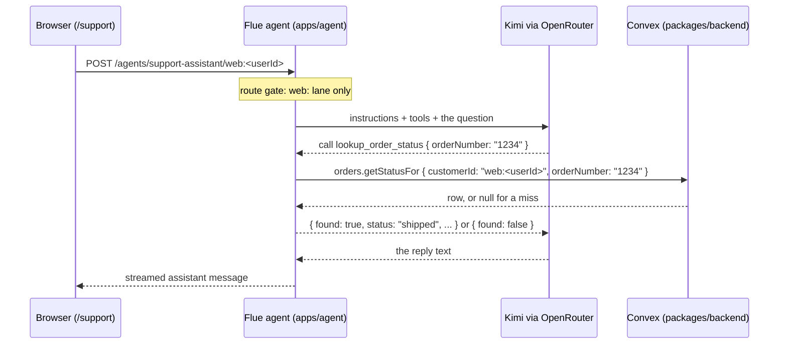
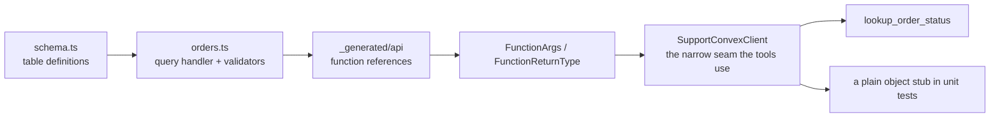
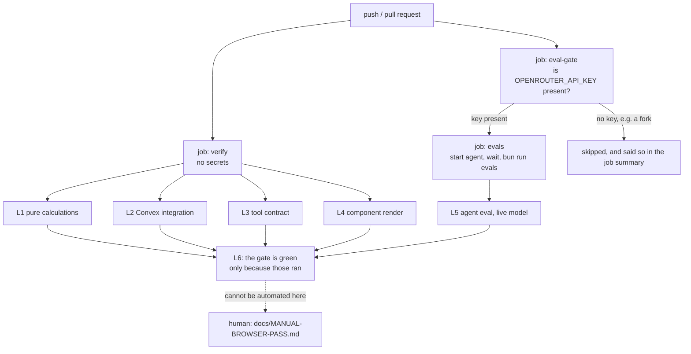

# FOR_ETHAN.md

The living production diary for the Flue support agent.

Read this as the DVD extras, not the manual. `README.md` tells you how to run the thing.
`docs/IMPLEMENTATION_PLAN.md` is the shooting script. This file is the part where the crew sits
down and explains what they were thinking, what blew up, and what they would tell you to do
differently.

This first cut covers **durability**: the six layers of testing, where Flue's batteries stop and
ours start, and why "green" lied here more than once before it became a gate. The build-out of the
architecture and decision sections comes later; every claim below traces to a file or a commit in
this repository.

---

## 1. The Story So Far

**Season 1: the sets got built, nobody ever rolled camera.**

An overnight autonomous run produced the whole skeleton of a multi-channel customer support agent:
a Convex schema with `orders`, `tickets` and `outbox`; the Convex functions over them; a
`lookup_order_status` tool and a guarded `send_reply`; a Flue agent that wires them to a model; and
a `/support` chat page in a Next app. It all compiled. It all passed lint.

None of it had ever run. The tables were empty, the agent had never spoken to a model, and the only
tests were over pure functions that could not touch a database. `docs/HANDOFF-2026-07-24.md` names
the gap in one sentence: "green proved only that it compiles, not that it works."

**Season 2: prove and gate what exists.**

`docs/IMPLEMENTATION_PLAN.md` is deliberately not a feature plan. Seven commits, almost no new
product code, all of it aimed at making the existing code demonstrably work and keeping it that
way:

| Commit | What landed | Where to look |
|---|---|---|
| 1 | Real Convex handlers run in-memory for the first time | `fe4dda8` |
| 2 | Seed data as one source of truth, plus index-scoped lookups | `c602c61`, `d89dccd` |
| 3 | Render tests for the chat primitives | `a1dbdbe` |
| 4 | Model swap to Kimi via OpenRouter | `aeb0448` |
| 5 | jsdom for `apps/web`, a chat render test, the manual browser runbook | `4b82291`, `7e50a75`, `f9f9725` |
| 6 | The Flue eval harness, two eval cases, a real paid run | `a387141`, `35f7515`, `e80601a` |
| 7 | The CI gate, and this document | `91e24c1` |

What is deliberately still missing: the WhatsApp lane, a real Twilio send, the escalation tools,
and any deploy. Those get their own plan. See the "Next" section of `docs/IMPLEMENTATION_PLAN.md`.

---

## 2. Cast & Crew (Architecture)

### The three rooms

Think of a post house. Footage lives in the vault, an editor works on it, and the audience only
ever sees the screen.

- **The vault: `packages/backend`.** Convex holds the orders, tickets and outbox rows, and the
  query and mutation functions that are the only sanctioned way in. Nothing else reads the tables
  directly.
- **The editor: `apps/agent`.** A Flue agent process. It holds the model, the instructions, and the
  tools. It is the only thing that talks to both the vault and the audience.
- **The screen: `apps/web`.** A Next app. `/support` renders `Chat.tsx`, which uses
  `useFlueAgent` from `@flue/react` and speaks HTTP to the agent process. It never touches Convex
  for order data.

### One question, end to end

A customer types "where is order #1234". Follow the signal like a patch on a soundboard: browser to
agent process, agent to model, model back through a tool, tool to Convex, and the answer back up
the same chain.



The load-bearing detail is the box the browser never fills in. `customerId` is not model input and
not request input. It is the conversation `id`, closed over when the tools are built
(`createSupportTools(id)` in `apps/agent/src/shared/support-tools.ts`). The model can choose the
order number. It cannot choose whose orders it is looking at.

That single string does three jobs at once, which is worth knowing before you debug anything here:

1. the HTTP route gate serves it only if it starts with `web:`
   (`isHttpLaneAuthorized`, `apps/agent/src/agents/support-assistant.ts`),
2. it is passed to Convex as `customerId`, so it is the data scope,
3. Flue keys the stored conversation by it, so it is also the session key.

### The safety net crew (the six layers)

Every layer catches a class of failure the others structurally cannot see. This is the table from
`docs/IMPLEMENTATION_PLAN.md`, updated to where each layer actually lives now that all six exist.

| Layer | Catches | Owner | Lives in |
|---|---|---|---|
| L1 pure calculations | status mapping, message view transforms, the lane gate | ours | `apps/agent/tests`, `apps/web/tests/message-view.test.ts` |
| L2 Convex integration | the database-to-app seam: scoping, outbox lifecycle, ticket transitions | ours | `packages/backend/convex/*.integration.test.ts` |
| L3 tool to Convex contract | closure scoping, the lane gate, drift from the real handlers | ours | `apps/agent/tests/support-tools.test.ts` |
| L4 component render | render-time crashes, accessible roles, the composition | ours | `packages/ui/tests`, `apps/web/tests/chat.test.tsx` |
| L5 agent eval | tool trajectory and anti-fabrication, against a live model | Flue | `apps/agent/src/evals` |
| L6 the gate | all of the above, on every push | ours, shaped by Flue's blueprint | `.github/workflows/ci.yml` |

A seventh row exists and is a human: the manual browser pass in
`docs/MANUAL-BROWSER-PASS.md`. It cannot be automated here (no browser, no auth secret in CI), and
L5 is its automatable proxy.

---

## 3. Behind the Scenes (Decisions)

### Where Flue's batteries stop

Flue ships a lot: the agent loop, the tool protocol, the HTTP surface, a React hook, an eval
harness blueprint, and a GitHub Actions blueprint. The temptation is to assume the framework covers
testing too, and to write nothing.

The boundary we settled on, and the reason it sits exactly there:

- **Flue owns the agent loop, so Flue owns L5.** The eval harness drives the agent through its
  public HTTP boundary using `@flue/sdk`, the same door the browser uses. We adapted it; we did not
  invent it.
- **Flue owns the gate's shape, so Flue's blueprint informs L6.** The workflow is ours, but the
  start-agent, wait-for-health, run-evals sequence is the blueprint's.
- **Convex is the data layer, and Flue has no opinion about it.** No amount of framework maturity
  will make Flue assert that a second customer cannot read your order. That is L2, and it stays
  hand-built forever.
- **The DOM is the presentation layer, and `@flue/react` gives you a data hook, not DOM
  assertions.** Whether `<Bubble>` mounts, and whether the customer's message lands on the correct
  side of the thread, is L4. Also hand-built forever.

That boundary is the whole "green gates lie" fix in one line: lean on the framework where the agent
loop lives, and never let it imply coverage of the two layers it structurally cannot reach.

### The seed is the single source of truth

You cannot demo a support bot against an empty database, and you cannot test one against a
different set of rows than the demo uses. So the demo data is defined exactly once, as data:

- `packages/backend/convex/seedData.ts` exports `DEMO_CUSTOMER_ID` and `DEMO_ORDERS`. No I/O, no
  logic. Just the list. Its row type is `Omit<Doc<"orders">, "_id" | "_creationTime" |
  "customerId">`, so a schema change breaks this file at compile time rather than at seed time.
- `packages/backend/convex/seed.ts` stages that list into a real deployment. It is an
  `internalMutation`, so nothing public can seed anything, and it patches on
  `(customerId, orderNumber)` rather than inserting, so running it twice cannot leave duplicate
  rows behind.
- `packages/backend/convex/seed.integration.test.ts` stages the same list into the in-memory test
  database and then queries it back through the real `orders.getStatusFor` handler.

One list, staged two ways. The demo and the tests can never disagree about what the data is, and
"order 1234 is shipped" is a fact both the eval suite and a human demo can rely on.

### convex-test rather than the cloud deployment

L2 runs the real handler code against an in-memory reimplementation of Convex. It is fast, it needs
no deploy key, it cannot be affected by whatever state somebody left in the dev deployment, and it
cannot corrupt that deployment either. The trade is that it is a reimplementation, not the real
backend, which is exactly why L5 exists: the eval suite reads the actual cloud deployment through
the actual tool.

### Kimi via OpenRouter, which is what unlocked L5 at all

The previous handoff deferred evals on cost. `openrouter/moonshotai/kimi-k2.6` made them cheap
enough to stop deferring: a measured two-case run costs roughly two cents and about fifteen seconds
of wall clock, at 2100 to 2400 tokens per case. A layer you can afford to run on every push is
worth more than a better layer you keep postponing.

One consequence to hold on to, because it shapes how the eval cases are written: Kimi is a
**reasoning model**. Its deliberation is visible in the response alongside the reply. See the
Director's Commentary below for why that matters.

### Evals are a separate command, not part of `turbo run test`

`bun run test` must stay fast, offline and free, because it runs constantly. `bun run evals` needs
a running agent process, a live database and a paid API key. Mixing them would mean either a slow,
expensive inner loop or an eval suite that silently never runs. So `*.eval.ts` is excluded from the
vitest `test` glob, and CI runs the two as separate jobs.

---

## 4. Bloopers (Bugs & Fixes)

### Take 1: the `<label>` that crashed on its first frame

**What happened.** A component change swapped the `Label` primitive to Base UI's `Field.Label`. It
type-checked. It passed lint. It satisfied the accessibility rule it was written to satisfy. It
also crashed the moment it rendered, because `Field.Label` requires a `Field.Root` ancestor that
was not there.

**Why nothing caught it.** `packages/ui` had no render tests. The type checker cannot see a runtime
context requirement, and the linter has no idea what a React context is. Both were green, and both
were right about what they actually check.

**The fix.** Two parts, and only the second one matters long-term. The immediate fix reverted to a
Radix `Label`, which works standalone. The durable fix is commit 3:
`packages/ui/tests/chat-primitives.test.tsx` mounts each primitive in jsdom, and the comment at the
top of that file says the quiet part out loud - a passing render *is* the assertion.

**The lesson.** A whole class of failure lives in the gap between "compiles" and "mounts". The only
instrument that reads it is actually mounting the thing.

### Take 2: the eval path that queried an empty database

**What happened.** The plan reached the eval commit with L2 green, the tool tests green, and the
`orders` table in the dev deployment completely empty. Every integration test passed because
`convex-test` seeds its own in-memory rows. Had the evals run at that point, the agent would have
correctly answered "I could not find order #1234", the anti-fabrication case would have passed, and
the lookup case would have failed with no obvious cause.

**Why nothing caught it.** No test in the suite reads the cloud deployment, by design. So the
suite's greenness carried no information about it at all.

**The fix.** Seed the deployment from the same list the tests use (`npx convex run seed:run`), and
verify by direct read rather than by inference. Then write the eval case so it cannot pass by
accident: the lookup case asserts the tool was called with `orderNumber: "1234"` **and** that it
came back `{ found: true, status: "shipped" }`, so an empty database fails it at the trajectory,
not just at the wording.

**The lesson.** An in-memory test tells you the code is right. It tells you nothing about whether
the data is there. Those need separate evidence.

### Take 3: the linter that linted nothing and reported success

**What happened.** The plan's CI job was `turbo run check-types lint test build`. `turbo.json`
declares a `lint` task, but no workspace package declares a `lint` script, so the task matched zero
packages, executed nothing, and exited 0 with a cheerful "Tasks: 0 successful, 0 total".

**Why it is the same bug as the other two.** A gate that cannot fail is indistinguishable, from the
outside, from a gate that passes.

**The fix.** `.github/workflows/ci.yml` runs the four root scripts as four named steps, which are
the same commands a developer runs locally. The real linter is the root script `oxlint && eslint
packages/backend/convex`.

**The lesson.** Before trusting any gate, make it fail on purpose once.

### Take 4: an eval suite that only passed the first time

**What happened.** The eval instance id has to be exactly `web:demo_customer`, because that string
is also the customer scope for the seeded rows. That means both eval cases share one conversation.
Run the suite twice against the same long-lived agent process and the second run fails: the agent
answers "I still couldn't find order #9999" from memory, without calling the tool at all. Zero tool
calls, and a correct assertion failing on an agent that was behaving sensibly.

**The fix, and the fix that was refused.** Loosening the "the agent looked it up" assertion would
have deleted the case's entire meaning, so that was off the table. Instead the harness now tracks
the message ids it produced and refuses to prompt an instance that already holds foreign ones,
failing in about 200ms with an explanation and no paid model call (`e80601a`). CI gets the correct
behaviour for free, because it starts a fresh agent process inside the job.

**The lesson.** When a test fails for an environmental reason, fix the environment or fail loudly
about it. Weakening the assertion converts a real signal into a permanently silent one.

---

## 5. Director's Commentary

> **Format for entries in this section.** Lead with the insight in plain language, then a short
> commented snippet of real code from this repository, then - only where the flow genuinely needs
> a picture - a mermaid diagram immediately after the snippet. Sequence diagrams for round trips,
> flowcharts for structure. Never lead with the diagram alone: the snippet is what proves the
> insight is about this codebase and not about software in general.

### Derive your types, never restate them

The tools call Convex functions. The naive way to type that is to write out the argument and return
shapes by hand in the tool file. That works for exactly as long as nobody edits the schema, and
then it silently lies, because a hand-written type has no relationship to the function it claims to
describe.

Convex generates an API object from your function files. Its types can be interrogated, so the tool
layer asks the generated API what a function takes and returns instead of asserting it:

```typescript
// apps/agent/src/shared/support-tools.ts
import { api } from "@support-agent/backend/convex/_generated/api";
import type { FunctionArgs, FunctionReturnType } from "convex/server";

// Ask the function reference what it takes and what it gives back. Nothing here
// restates a shape, so nothing here can drift from the handler.
type OrderStatusQueryArgs = FunctionArgs<typeof api.orders.getStatusFor>;
type OrderStatusRow = NonNullable<FunctionReturnType<typeof api.orders.getStatusFor>>;
```

Change `orders.getStatusFor` to require a third argument and the agent package stops compiling. The
schema is the negative; every type downstream is a print from it.



The same discipline runs the other way through `seedData.ts`, whose row type is derived from
`Doc<"orders">`, and through `SupportConvexClient`, which is deliberately narrowed to the one query
and the three mutations the tools use - one overload per function, assembled by intersecting the
escalation module's own slice. Narrow enough to satisfy with an object literal in a test, wide
enough that the real `ConvexHttpClient` still assigns to it.

The same trick names a status without restating it. `create_ticket` needs the literal `"open"` for
its output schema, and `"open"` is the backend's word, not the agent's, so the agent asks:

```typescript
// apps/agent/src/shared/escalation-tools.ts
type TicketStatus = FunctionArgs<typeof api.tickets.setStatus>["status"];

// `satisfies` keeps the literal type - the output schema stays precise - while
// still checking the string against the backend's own union.
const TICKET_OPEN = "open" as const satisfies TicketStatus;
```

### Authorization belongs in the closure, not in the schema

A tool's input schema is a description of what the model may say. It is not a security boundary,
because the model writes the input. Anything the model must not choose has to come from somewhere
the model cannot reach.

```typescript
// apps/agent/src/shared/support-tools.ts
// What the model passes in: just the order number. Deliberately no customer
// field - the caller's identity comes from the closure, never the model.
const lookupOrderStatusInput = v.object({ orderNumber: v.string() });

// ...and inside `createSupportTools(id)`, where `id` is the conversation key:
run: async ({ input }) => {
  const row = await client.query(api.orders.getStatusFor, {
    customerId: id,                      // from createSupportTools(id), not from input
    orderNumber: input.orderNumber,      // the only thing the model gets to decide
  });
  return toLookupOrderStatusOutput(row);
},
```

`send_reply` takes the same idea one step further: it throws unless the conversation `id` is on the
`whatsapp:` lane, so a browser session structurally cannot text a phone. The refusal lives in
`run`, before any I/O, and it is unit-tested as a pure decision.

The escalation pair shows the third move in the same family: leaving something out. `create_ticket`
and `message_a_human` take a `subject` and nothing else - no customer id, no conversation key, and
crucially no ticket id. `message_a_human` escalates the ticket its own `create` call just returned,
so there is no turn of the conversation in which the model holds a ticket id it could aim somewhere
else. `tickets.setStatus` does not check ownership, and it does not have to, because no session can
name a ticket that is not its own. Compare that with an input schema that accepted `ticketId` and
then had to be defended: the defence is the thing that eventually gets forgotten.

### Assert on what the user reads, not on what the model thought

Kimi is a reasoning model. Its deliberation is returned alongside its reply, and that deliberation
legitimately contains words like "shipped" while the reply correctly declines to state a status.
Assert against the transcript and you will eventually fail an agent that behaved perfectly.

```typescript
// apps/agent/src/evals/support-assistant.eval.ts
// Assert on the reply only. `kimi-k2.6` reasons out loud, and its deliberation
// legitimately contains status words while the reply correctly declines.
expect(result.output).toContain(UNKNOWN_ORDER);
expect(statusWordsIn(result.output)).toEqual([]);
```

Two related choices in that file are worth copying. `statusWordsIn` scans the **whole**
`ORDER_STATUSES` vocabulary rather than just the seeded `shipped`, which is what makes "it did not
invent a status" a real claim instead of one lucky word. And both cases assert over the whole list
of tool calls rather than assuming exactly one, because an agent that retries with a reformatted
order number is behaving correctly and an eval that fails it is a bad eval.

### Green means all six layers ran

This is the rule the whole durability slice exists to make true. "The build is green" is only
meaningful if you can say which layers produced that green. In this repository you can point at the
file:

```yaml
# .github/workflows/ci.yml, job `verify`, step names elided.
# L1 through L4, no secrets, so forks and secretless pull requests run all of it.
- run: bun run check-types   # the type floor the four layers stand on
- run: bun run lint          # the ROOT script, not `turbo run lint` - see Take 3
- run: bun run test          # L1, L2, L3 and L4: every vitest suite in the monorepo
- run: bun run build         # the Next build, which also validates the env schema
```



Three things that diagram is being honest about, and each one is a decision rather than an
accident:

1. **The evals job reports *skipped*, not *passed*, on a fork.** The `secrets` context is not
   readable from a job-level `if`, so a small gate job turns the secret into an output first. The
   alternative, guarding every step with the same condition, would have shown a green "success"
   with all steps skipped. That is a green that means nothing, which is the failure this whole
   document is about.
2. **A run with a model key but no `CONVEX_URL` fails loudly.** A fork has neither and never
   arrives; a repository with one and not the other is misconfigured, and it gets an explicit
   error instead of a paid model call against a database it cannot read.
3. **L6 cannot cover the browser pass.** No browser exists in CI, and no test claims otherwise.
   That step is a documented human runbook, and L5 is its proxy. An honest gate names what it does
   not cover.
