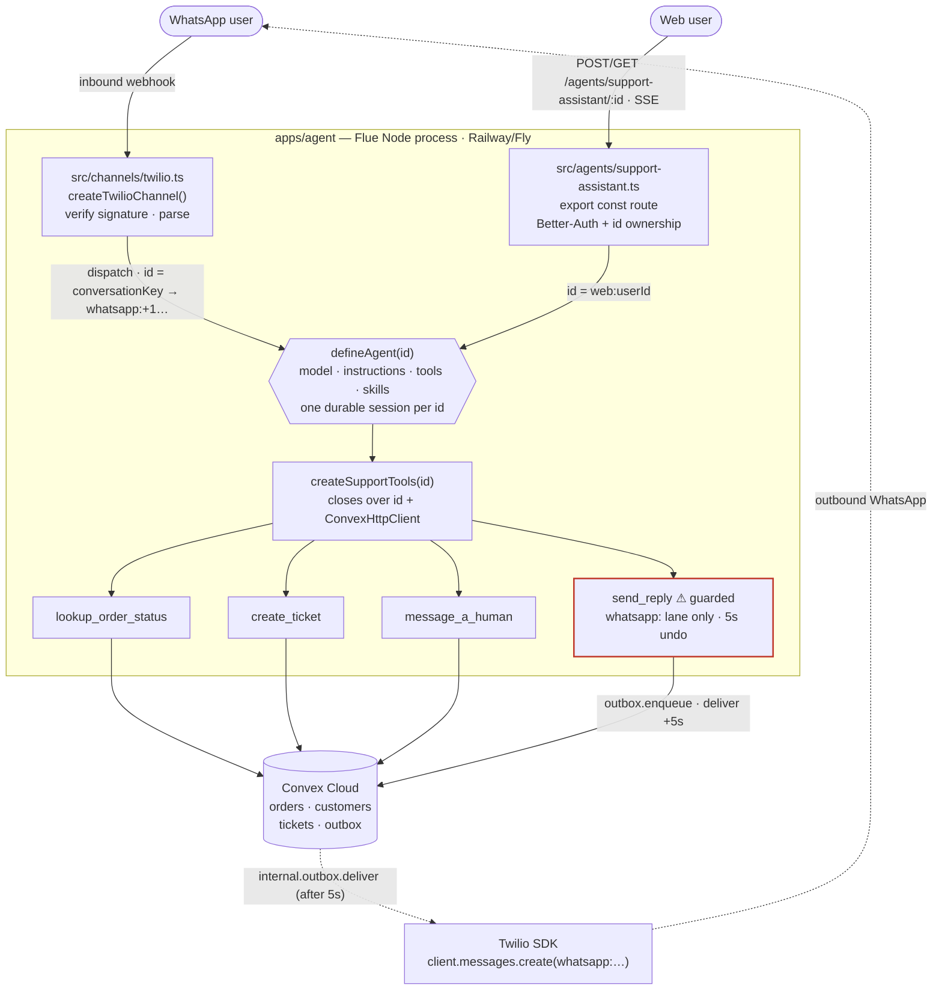

# Plan: Multi-Channel Support Agent on Flue — DevRel Spec Project

## Context

Ethan is applying for a **Developer Relations role at Sierra** (with a warm referral — a bootcamp
teacher now works there). The deliverable is a **spec/portfolio project**: a *working, deployed*
demo agent **plus a produced video tutorial** teaching how to build a custom agent on **Flue** (the
new Astro-team agent framework). The video is the primary artifact because DevRel is public-facing
and video-production experience is a major plus for the role.

The project also does double duty: it re-approaches **Plan Monster** (who passed on Ethan for the
"Monty" back-office agent take-home but said "when we expand, we'll reach back out"). Shipping a
**multi-channel** agent is the proof-of-growth to point them to.

The work is a translation of Ethan's own Monty architecture (`pm-interview-dashboard-main`, and the
two prep docs in `~/Downloads/FLUE_*.md`) onto Flue's vocabulary — keeping the *ideas*
(identity-at-ingestion, validated tool boundary, anti-fabrication rule, undo-send, offline
verification) while learning where Flue already owns the machinery he hand-wrote.

**Outcome:** one deployed, clickable web demo + a live WhatsApp demo + a video that teaches Flue and
lands the "trust / the determinism dial" thesis that is Sierra's exact market.

## Decisions locked (with the user)

| Decision | Choice | Why |
|---|---|---|
| Deliverable | Working demo **+ produced video tutorial** | DevRel role; video is the differentiator |
| Domain | **E-commerce customer support** | Sierra's wheelhouse; universally legible; multi-channel proof for Plan Monster |
| Channels | **Web chat (door 1) + WhatsApp via Twilio sandbox (door 2)** | WhatsApp is on Sierra's channel list, faithful to Monty's `jid` identity model, sandbox needs no Meta business verification / no US A2P 10DLC paperwork |
| Schema lib | **Valibot at the Flue boundary; Zod only for env** | Flue hard-requires Valibot (`defineTool`/`prompt({result})` are typed `v.GenericSchema`). **No Zod↔Valibot conversion layer** — that would be over-engineering |
| Runtime/deploy | Flue as a **separate long-lived Node process** (`apps/agent`), NOT Vercel serverless | Flue requires one owner process per agent instance; serverless can't hold it |
| Verification | **`vitest-evals`** over the real `route` | Flue ships **no** faux/scripted model provider (probed — the notes were wrong on this) |

## Reality already probed (T0 partially resolved from installed types)

Resolved from `node_modules/@flue/runtime/dist/*.d.mts` — no need to re-litigate:
- **`defineAgent`**, not `createAgent` (`createAgent` is a `@deprecated` alias).
- **`export const route`** (a Hono `MiddlewareHandler`), not `triggers` — `triggers` does not
  exist in the type surface.
- Agent files live at `<sourceRoot>/agents/<name>.ts`; resolution order `.flue/` → `src/` →
  root. Use **`src/agents/`**.
- **`ToolContext` is only `{ signal?, input }`** — no `deps`, no `env`, no Convex handle. **Tools
  reach Convex via closure**, not via context. (This drives the whole tool architecture below.)
- **No faux model provider** ships. `./test-utils` exports only store contract-test builders.
  Verification = `vitest-evals`.

**Still must be verified by actually installing/running (T0 checklist for the build):**
1. `@flue/twilio`, `@flue/react` are not yet installed — `flue add channel twilio` / `flue add
   tooling vitest-evals` install + scaffold them. Exact `createTwilioChannel` options and
   `channel.conversationKey()` shape are from the shipped docs
   (`node_modules/@flue/cli/docs/ecosystem/channels/twilio.md`), not disk types — confirm on
   install.
2. Built Node entry / port, and that the built server does **not** auto-load `.env` (`flue dev`
   does).
3. `ConvexHttpClient` (`convex/browser`) bundles under the Node target.
4. Model provider env var (`ANTHROPIC_API_KEY`) reaches the agent.

## Architecture

Two doors, one `AgentDefinition`, one per-`id` durable session each.



**Deploy topology:** `apps/agent` (Flue Node app) → Railway/Fly with persistent disk + `db.ts` =
`sqlite('./data/flue.db')`; `apps/web` (Next) → Vercel; `packages/backend` → Convex Cloud. Note
on camera: Cloudflare target (Durable Objects) is a one-line `target` swap that buys per-instance
session durability for free — the upgrade path, not the demo default.

## Convex data model

**File:** `packages/backend/convex/schema.ts` — currently `defineSchema({})`, empty.
**Validators:** Convex's own `v` (from `convex/values`). **Not** Valibot.

Four small tables. One job each.

### 📦 `orders`
- **Is:** the thing customers ask about
- **Fields:** `customerId` · `orderNumber` · `status` · `updatedAt`
- **Status flow:** `packed` → `shipped` → `delivered` → `cancelled`
- **Index:** `by_orderNumber`

### 👤 `customers`
- **Is:** the link between the two channel lanes — **context only, never merges sessions**
- **Fields:** `email?` · `phone?`
- **Index:** `by_phone` · `by_email`

### 🎫 `tickets`
- **Is:** one support case, tied to one conversation
- **Fields:** `conversationKey` · `customerId?` · `subject` · `status` · `createdAt`
- **Status flow:** `open` → `needs_human` → `resolved`
- **Index:** `by_conversationKey`

### ⏳ `outbox`
- **Is:** where **undo-send lives** — durable, survives Flue restarts
- **Fields:** `conversationKey` · `to` · `body` · `status` · `scheduledFor`
- **Status flow:** `pending` → `sent` **or** `cancelled`
- **Index:** `by_conversationKey`

### Functions (all thin)

| Function | Kind | Does |
|---|---|---|
| `orders.getStatusFor` | query | look up one order, scoped to the caller |
| `tickets.create` | mutation | open a ticket |
| `tickets.setStatus` | mutation | move a ticket (e.g. → `needs_human`) |
| `outbox.enqueue` | mutation | insert `pending` + `scheduler.runAfter(5000, …deliver)` |
| `outbox.cancel` | mutation | flip `pending` → `cancelled` before it fires |
| `internal.outbox.deliver` | internalAction | the real Twilio send, +5s later |

> **Skipped — a `messages` table.**
> Flue already owns the canonical per-conversation transcript, so mirroring it is speculative.
> _ponytail: don't duplicate the transcript; add only if cross-channel analytics ever needs it._

## Tools

**File:** `apps/agent/src/shared/support-tools.ts`
**Schemas:** Valibot.  **Auth:** inside `run`, never the schema.

### The factory

`createSupportTools(id)` closes over two things:
- **`id`** — the conversation key, and the **auth boundary**
- a module-level **`ConvexHttpClient`**

Each tool is `defineTool({ name, description, input, output, run })`.
`run` receives `{ input, signal }` — **no `deps`, no Convex handle** (that's why it closes over
the client).

### The four tools

| Tool | Does | Guard |
|---|---|---|
| `lookup_order_status` | look up an order (`input: { orderNumber }`), scoped to `id` | — |
| `create_ticket` | open a ticket for the conversation | — |
| `message_a_human` | flip the ticket to `needs_human` (escalation) | — |
| `send_reply` | send an outbound message | ⚠️ **guarded** ↓ |

### ⚠️ `send_reply` — the guarded one

- **Lane gate:** `if (!id.startsWith('whatsapp:')) throw` — a browser session must not text a
  phone
- **Undo window:** calls `outbox.enqueue` → delivered **+5s**, cancellable inside the window
- **Durable, not a timer:** the delay lives in Convex (`scheduler.runAfter`), **not** an in-process
  `setTimeout` → survives Flue restarts

> **Load-bearing principle (ported from Monty):**
> The Valibot schema checks **shape only**. **Authorization lives inside `run`.**
> - derive the customer scope from `id`
> - gate `send_reply` to the WhatsApp lane
> - enforce opt-out / rate limits there

## The identity decision (a written beat, not just code)

**Two lanes, one agent.** `id = "web:<convexUserId>"` (authorized by `route` + Better-Auth) vs `id =
"whatsapp:+1..."` (authorized by Twilio signature). Each `id` is its own durable session;
cross-channel context is correlated in Convex `customers`, never merged into one session.

**Rejected alternative:** one unified session keyed by resolved customer identity. Rejected because
(1) an unverified inbound phone number can't be safely bound to a web account without a separate
verification step — a shared key leaks one channel's session into the other; (2) a merged session
would carry the WhatsApp-bound `send_reply` into a web chat; the lane prefix in `id` is exactly what
lets `send_reply` gate itself. This is the paragraph Sierra would actually ask for (decision ·
alternative · why).

## Web UI — steel thread first, shadcn preset second

Built in two phases.

**Phase 1 (steel thread, already built + being tested):** `packages/ui` already exports the chat
surface (`bubble.tsx`, `message.tsx`, `message-scroller.tsx`, `attachment.tsx`, `marker.tsx`), and
`apps/web/src/app/support/` already has `page.tsx` + `Chat.tsx` composing them, wired to
`@flue/react`'s `useFlueAgent({ name:'support-assistant', id })` inside a `FlueProvider` (mirroring
the existing `providers.tsx` pattern). It maps `agent.messages[].parts` -> `Message`/`Bubble` (user
`align="end"`, assistant `align="start"`). This is what the durability plan wires and render-tests;
no new primitives at this stage.

**Phase 2 (shadcn preset rebuild, later separate commit):** apply the chosen shadcn preset, then rip
the richer chat composition (sidebar, skeleton, toast, richer message/bubble states) from
`ai-chatbot-new` and `pm-interview-dashboard-main`. The render tests from phase 1 guard the swap.

```sh
bunx --bun shadcn@latest apply --preset b2aBcY9IDw
```

Preset covers: bubble, message, message-scroller, skeleton, toast, sidebar.

## Build sequence — STEEL THREAD (each step = 1 commit = 1 video chapter)

Prove one vertical slice end-to-end and **deploy it** before adding breadth.
1. **Scaffold `apps/agent`** — `flue init` (Node target); smallest `defineAgent` + `export const
   route`; `flue run` a prompt. *Proves the runtime; feel the loop you no longer hand-write.*
2. **Convex tables + first tool** — `orders` + `orders.getStatusFor`; `createSupportTools(id)`
   with `lookup_order_status` only. *Proves the tool→Convex closure — the load-bearing pattern.*
3. **Web surface** — `/support` page from the existing `packages/ui` chat components; `route`
   enforces auth. End-to-end web chat looking up a real order.
4. **Deploy the slice** — `flue build` → Railway/Fly with `db.ts`; web `baseUrl` → agent.
   **Steel thread live in production.**
5. **WhatsApp door** — `flue add channel twilio`; `src/channels/twilio.ts` dispatches to `id =
   channel.conversationKey(...)` (`whatsapp:+1...`). Join the Twilio sandbox; inbound WhatsApp →
   same agent.
6. **Outbound + guarded send** — `outbox` + scheduler; `send_reply` (lane-gated, 5s undo). Demo
   sending then cancelling within 5s.
7. **More tools + escalation** — `create_ticket`, `message_a_human`; `tickets` statuses.
8. **A skill** — `src/skills/refund-policy/SKILL.md`, imported `with { type:'skill' }`, invoked
   via `session.skill(...)`. *The agent's expertise as a readable markdown file — most demoable
   Flue feature.*
9. **Regression harness** — `flue add tooling vitest-evals`; `describeEval` asserting
   `lookup_order_status` fires and answers are correct. *Ethan's `loop.test.ts` instinct, in Flue's
   sanctioned form.*

## Video / DevRel layer (the primary deliverable)

Split of labor: **this project builds the code + writes the video script/storyboard + the blog
companion; Ethan records + edits the video** (I can't produce video).
- **Format:** screencast tutorial, chapters = the 9 commits above. Canonical home = a post on
  `ethan-astro-blog` with the video embedded + links to the repo and the live demo; that single URL
  is what attaches to the résumé/cover letter.
- **"Here's where I got lost" beats to script (write them down while fresh — that reconstruction
  IS the DevRel job):** the *outbound-is-not-a-channel* trap (channels are inbound-HTTP-only;
  outbound uses the Twilio SDK); `ToolContext` has no `deps` so tools reach data by closure; **Flue
  ships no faux provider** so verification moves to `vitest-evals`; the Valibot-vs-Zod boundary (and
  the two `v`s — Flue's valibot vs Convex's validators).
- **Closing thesis (what makes it a *Sierra* piece, not a generic tutorial):** the three layers —
  **Flue = framework (opinion: autonomy) · Pi = harness (unopinionated) · Sierra = product (the
  dial)**. Autonomy is cheap when the worst case is a bad reply and expensive when it's a message to
  a real customer. Trust is the product. Show the guarded `send_reply` as the concrete embodiment.

## Verification (end-to-end)

- **Local agent:** `flue dev` in `apps/agent`; `flue run agent:support-assistant --input
  '{"message":"where is order #1234"}'` → tool fires, real Convex data returned; fake order →
  clean miss, no hallucinated status.
- **Web:** `bun run dev`; open `/support`; chat looks up a seeded order; ask something tools can't
  answer → it declines rather than inventing (anti-fabrication).
- **WhatsApp:** join Twilio sandbox (text the join code); message the sandbox number → dispatch
  appears in agent logs → reply arrives; trigger `send_reply` then cancel within 5s → nothing
  delivered.
- **Evals:** `bun run test` (vitest-evals) green on the tool-trajectory cases.
- **Deployed:** agent on Railway/Fly, web on Vercel, Convex Cloud; message from a phone outside the
  dev machine → green.

## Critical files
- `packages/backend/convex/schema.ts` — add `orders`/`customers`/`tickets`/`outbox` + functions
  (currently `defineSchema({})`).
- `apps/agent/src/agents/support-assistant.ts` *(new)* — `defineAgent` + `export const route`; the
  one agent both doors hit.
- `apps/agent/src/shared/support-tools.ts` *(new)* — `createSupportTools(id)`; tool→Convex
  closure + in-`run` authz.
- `apps/agent/src/channels/twilio.ts` *(new)* — `createTwilioChannel` + `dispatch({ id:
  channel.conversationKey(...) })`; WhatsApp lane.
- `apps/agent/src/skills/refund-policy/SKILL.md` *(new)* — the demoable skill.
- `apps/web/src/app/support/page.tsx` + `Chat.tsx` *(new)* — `useFlueAgent` composed from existing
  `packages/ui` chat components.
- API-pinning references: `node_modules/@flue/runtime/dist/tool-types-CcKIl663.d.mts` (`ToolContext
  = {signal,input}`), `.../types-USSZhfC6.d.mts` (`AgentRuntimeConfig`, `route`),
  `node_modules/@flue/cli/docs/ecosystem/channels/twilio.md`, `.../guide/react.md`,
  `.../guide/evals.md`.

## Out of scope (deliberate)
- No SMS/voice/email doors (WhatsApp + web is enough to prove multi-channel).
- No unified cross-channel identity (two lanes — see decision above).
- No custom faux model provider (use `vitest-evals`; build one only if eval cost/flakiness forces
  it).
- No `messages` mirror table (Flue owns the transcript).
- Cloudflare/Durable-Objects target = mentioned as upgrade path, not built.
